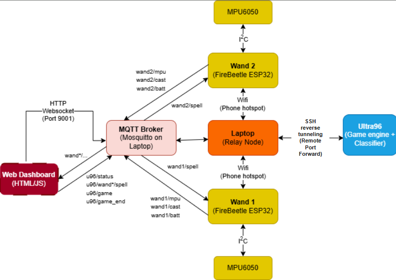

# Wizard Game IoT project

## MQTT-Based Communication System
 In the Wizard Game, the interaction between the U96 development board (acting as the central game server) and the two player wands (acting as IoT clients) is managed using the MQTT (Message Queuing Telemetry Transport) protocol. MQTT provides a lightweight, publish–subscribe messaging structure that ensures reliable, low-latency communication between devices — ideal for real-time gameplay.

## System Architecture

## File Structure
1. AI
    1. Software
        Contains the AI pipeline for the prediction of spells drawn using the wand. Prediction is made using a window size of 60 mpu data sampled by the ESP32-Firebeetle 
    2. Hardware
        Contains cpp code of the model created, that will be converted to verilog code and bitstream to be generated and uploaded to the Ultra96, for AI model to be run on the onboard FPGA
    3. wand_dataset
        Contains mpu dataset collected to be used for training/testing.

2. certs
    1. Contain the certs that are used to allow for secure transmission of data between all devices

3. Comms
    1. Server_final.py is the code to be run on U96, the following are the threads ran in parallel on the U96:
        1. Game thread
        2. Comms thread
        3. AI prediction thread

4. Hardware
    1. ESP32_MQTT.ino is the code to be uploaded to the ESP32-Firebeetles on the wands, allowing for the wands to send battery  info and stream mpu data to the U96, and receive game state data packets from the U96.

5. Web
    1. Contains visualiser code